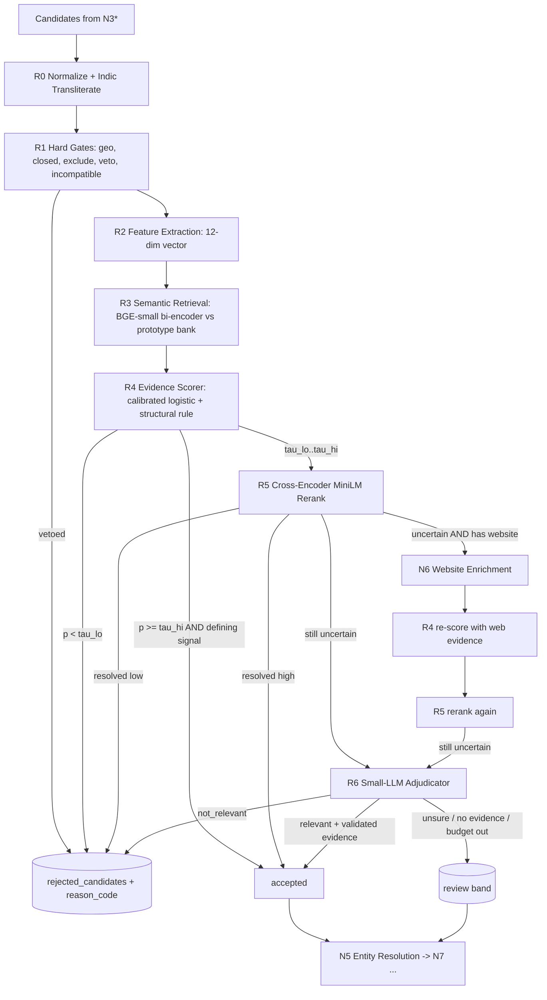

# LeadCore Zero v2 — LangGraph Multi-Agent Architecture

## Graph Topology

The system execution is orchestrated as a compiled **LangGraph `StateGraph`** with a Postgres checkpointer (`PostgresSaver`) running on Neon Postgres.

```
                  ┌──────────────┐
                  │   n0_input   │
                  └──────┬───────┘
            ┌────────────┴────────────┐
            ▼                         ▼
     ┌──────────────┐          ┌──────────────┐
     │    n1_geo    │          │  n2_keyword  │
     └──────┬───────┘          └──────┬───────┘
            │                         │
            ▼                         │
   [disambiguation_interrupt?]        │
            │                         │
            └────────────┬────────────┘
                         ▼
                  ┌──────────────┐
                  │ join_geo_kw  │
                  └──────┬───────┘
         ┌───────────────┼───────────────┬───────────────┐
         ▼               ▼               ▼               ▼
  ┌──────────────┐┌──────────────┐┌──────────────┐┌──────────────┐
  │ n3a_overture ││ n3b_overpass ││ n3c_wikidata ││  n3e_imports │
  └──────┬───────┘└──────┬───────┘└──────┬───────┘└──────┬───────┘
         └───────────────┼───────────────┴───────────────┘
                         ▼
                  ┌──────────────┐
                  │  n4_filter   │
                  └──────┬───────┘
                         ▼
                  ┌──────────────┐
                  │  n5_resolve  │ (Splink ER + Union-Find Clustering)
                  └──────┬───────┘
                         ▼
                  ┌──────────────┐
                  │  n6_enrich   │ (Scrapling Web Crawl + RAG)
                  └──────┬───────┘
                         ▼
                  ┌──────────────┐
                  │  n7_verify   │ (Multi-source Checks)
                  └──────┬───────┘
                         ▼
                  ┌──────────────┐
                  │   n8_score   │ (Confidence Scoring)
                  └──────┬───────┘
                         ▼
                  ┌──────────────┐
                  │  n9_critic   │ ──(borderline & budget left)──► n6_enrich
                  └──────┬───────┘
                         │ (pass)
                         ▼
                  ┌──────────────┐
                  │ n10_persist  │ (Neon Global Dedup & Staging)
                  └──────┬───────┘
                         ▼
                  ┌──────────────┐
                  │   n11_eval   │ (Capture-Recapture N̂ + Wilson CIs)
                  └──────┬───────┘
                         ▼
                  ┌──────────────┐
                  │  n12_report  │ (Run Finalization & SSE Event)
                  └──────┬───────┘
                         ▼
                       [END]
```

## Node Contracts

| Node ID | Name | Critical | Description |
|---|---|---|---|
| `n0_input` | InputNormalizer | Yes | Normalizes location strings and validates query inputs. |
| `n1_geo` | GeoResolverAgent | Yes | Queries Overture divisions & Nominatim with boundary polygons and fallback buffers. |
| `n2_keyword` | KeywordPlannerAgent | Yes | Curated rules + RAG over `taxonomy_vectors` for Indian SMB synonyms and OSM tags. |
| `n3a_overture` | OvertureWorker | No | DuckDB spatial predicate pushdown querying public S3 Parquet releases. |
| `n3b_overpass` | OverpassWorker | No | OSM Overpass API queries with automatic multi-endpoint failover and rate limiting. |
| `n4_filter` | Relevance Engine Cascade | Yes | Explainable R0–R6 cascade (tokenization, hard gates, prototype bi-encoders, cross-encoder rerank, small-LLM adjudication) classifying candidates into accepted, review, and rejected. |
| `n5_resolve` | EntityResolverAgent | Yes | Geohash-7 & phone/domain blocking, probabilistic matching, and golden record selection (merges relevance as max evidence over cluster members). |
| `n6_enrich` | WebsiteEnrichmentAgent | No | Scrapling spider crawl with robots.txt compliance, AutoThrottle, and deterministic + RAG extraction with targeted relevance re-pass on borderline review candidates. |
| `n7_verify` | VerificationAgent | Yes | Independent cross-source verification checks (phone, email, website, geometry). |
| `n8_score` | ConfidenceScorer | Yes | Calibrated logistic scoring model with tier thresholds (Verified ≥ 0.80, Likely ≥ 0.60). |
| `n9_critic` | QualityCritic | Yes | Re-enrichment router loop (max 2 iterations) for borderline entities. |
| `n10_persist` | GlobalDedup & Persister | Yes | Neon PostGIS spatial (lon-first) and domain deduplication with idempotent upsert of decision, relevance_p, stage, features, and reason chips. |
| `n11_eval` | EvaluatorAgent | No | Lincoln-Petersen capture-recapture total population estimator and field completeness rates. |
| `n12_report` | RunReporter | Yes | Status finalization in `query_runs` and terminal SSE event emission. |

## N4 Relevance Engine Cascade Subgraph



