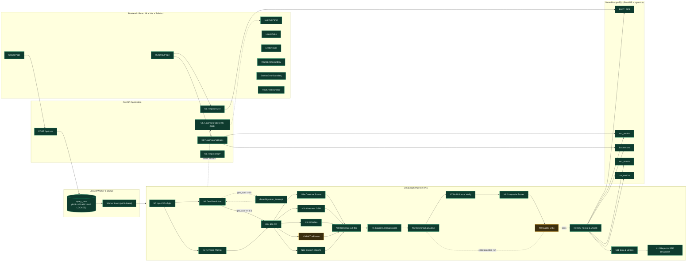
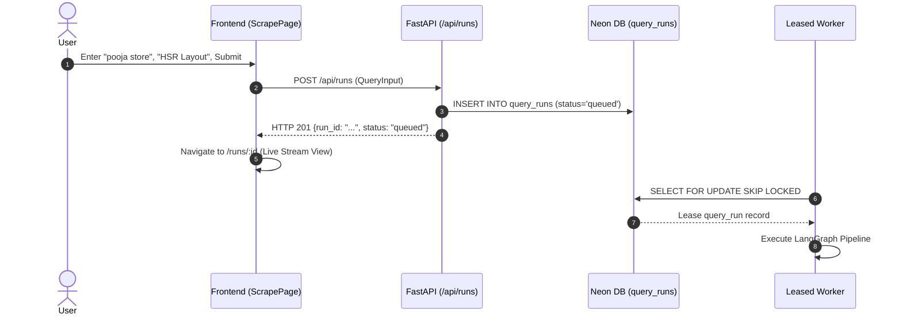
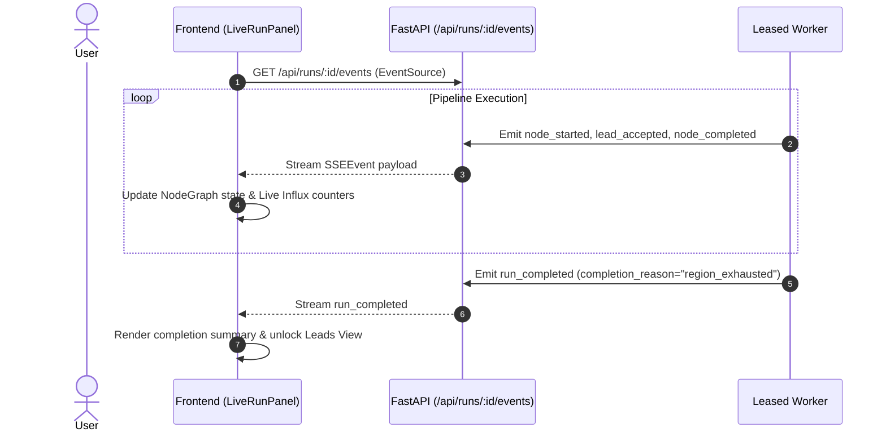
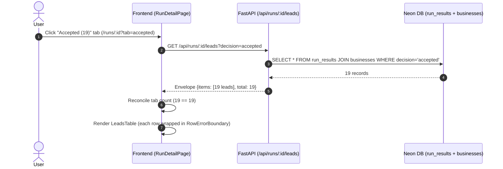
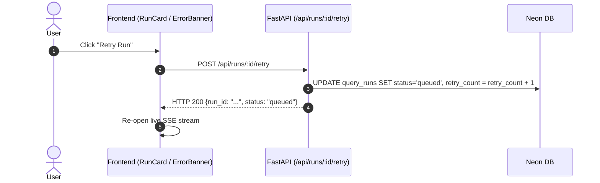
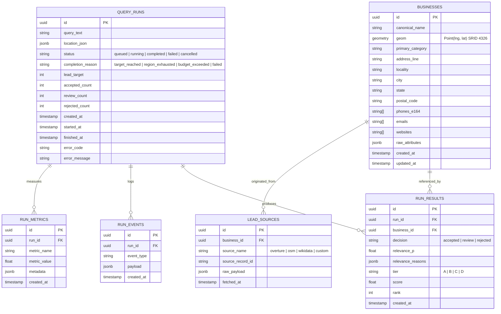
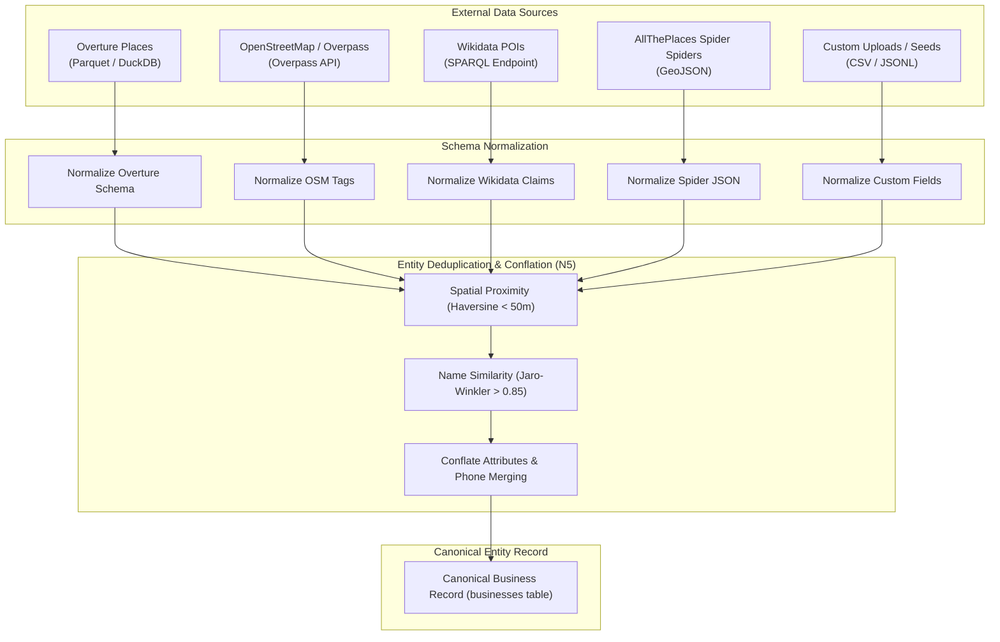
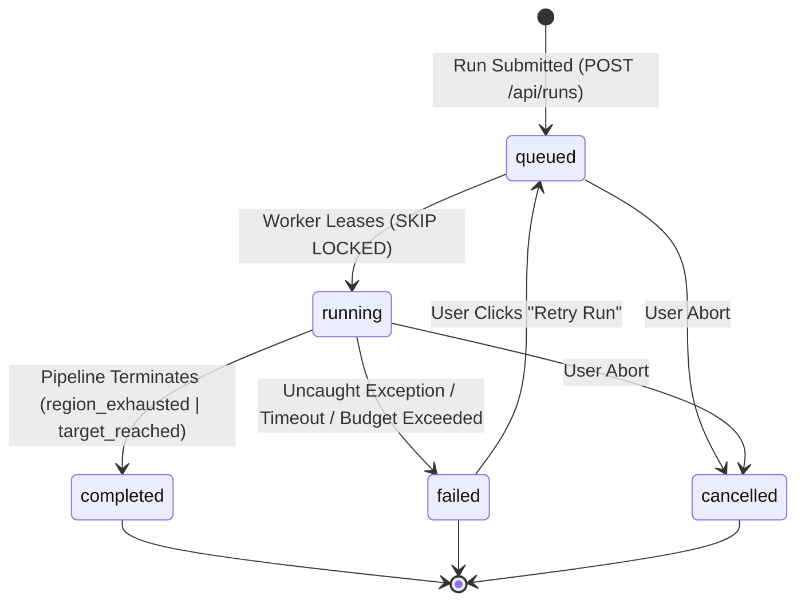
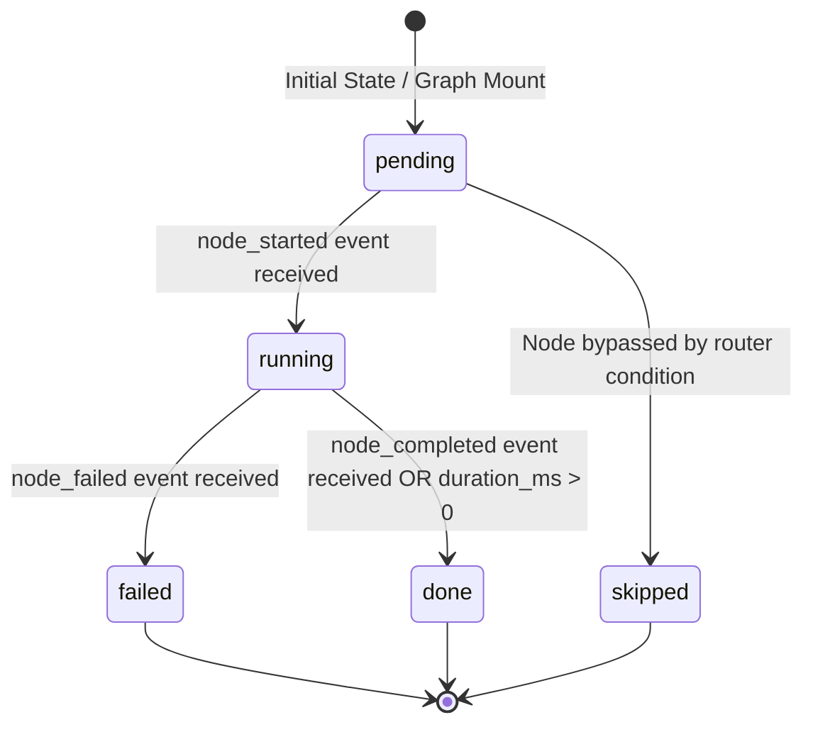
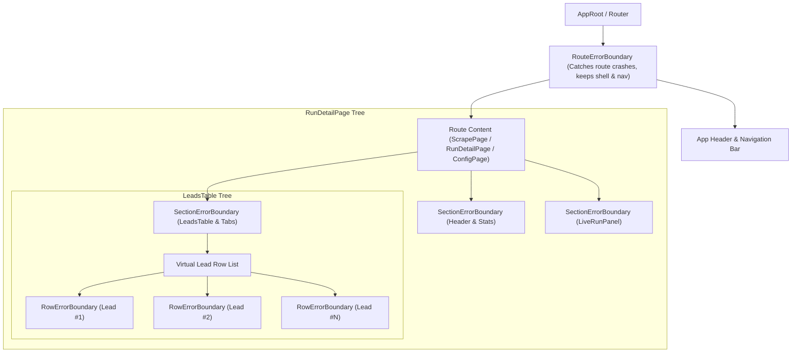

# LeadCore Zero — Living Architecture Graph
Last updated: 2026-09-23 · Updated by: Principal AI/ML Engineer & Senior Frontend Architect · Status: Active Source of Truth

---

## 1. System Map



---

## 2. Component Register

| ID | Component Name | Source File | Status | Contract In → Out | Test Coverage | Notes |
|:---|:---|:---|:---|:---|:---|:---|
| **N0** | Input Normalizer | `app/graph/nodes/n0_input.py` | `implemented` | `RunState` (raw query) → `RunState` (normalized `QueryInput`) | `tests/test_plan.py` | Validates query format, sets initial budget |
| **N1** | Geo Resolver | `app/graph/nodes/n1_geo.py` | `implemented` | `QueryInput.location` → `GeoResolution` (bbox, geom, confidence) | `tests/geo/`, `tests/test_geo.py` | Uses Nominatim + local Indian gazetteer fallback |
| **INT** | Disambiguation Interrupt | `app/graph/nodes/n1_geo.py` | `implemented` | Low geo confidence (<0.6) → Human choice → Resumed `GeoResolution` | `tests/geo/test_disambiguation.py` | LangGraph `interrupt()` pause/resume |
| **JOIN** | Geo-Keyword Join | `app/graph/build.py` | `implemented` | `GeoResolution` + `KeywordPlan` → Fan-out router | `tests/graph/test_graph_structure.py` | Pass-through synchronization barrier |
| **N2** | Keyword Planner | `app/graph/nodes/n2_keyword.py` | `implemented` | `QueryInput.keywords` → `KeywordPlan` (expansions, categories) | `tests/test_plan.py` | Multilingual & semantic category expansion |
| **N3a** | Overture Source Connector | `app/graph/nodes/n3a_overture.py` | `implemented` | `GeoResolution` bbox + `KeywordPlan` → `list[RawEntity]` | `tests/test_sources.py` | DuckDB spatial query over Parquet partitions |
| **N3b** | Overpass OSM Connector | `app/graph/nodes/n3b_overpass.py` | `implemented` | `GeoResolution` polygon → `list[RawEntity]` | `tests/test_sources.py` | Overpass QL with local caching & retry |
| **N3c** | Wikidata Connector | `app/graph/nodes/n3c_wikidata.py` | `implemented` | `GeoResolution` + `KeywordPlan` → `list[RawEntity]` | `tests/test_sources.py` | SPARQL query for notable entities |
| **N3d** | AllThePlaces Connector | `app/graph/nodes/n3d_alltheplaces.py` | `stub` | `GeoResolution` → `list[RawEntity]` | `tests/test_sources.py` | Spider scrapers stubbed for future expansion |
| **N3e** | Custom Imports Connector | `app/graph/nodes/n3e_imports.py` | `implemented` | Seed data / CSV uploads → `list[RawEntity]` | `tests/test_imports.py` | Custom user-supplied lead lists |
| **N4** | Relevance Filter | `app/graph/nodes/n4_relevance.py` | `implemented` | `list[RawEntity]` → Filtered entities with `relevance_p`, `decision` | `tests/relevance/`, `tests/eval/` | Multi-criteria keyword & category matching |
| **N5** | Spatial Resolver & Dedup | `app/graph/nodes/n5_resolve.py` | `implemented` | Merged entities → Deduplicated canonical entities | `tests/db/test_dedup_rules.py`, `tests/test_resolver.py` | Haversine distance + Jaro-Winkler string similarity |
| **N6** | Web Crawl & Enrichment | `app/graph/nodes/n6_enrich.py` | `implemented` | Canonical entities → Enriched (phones, emails, socials) | `tests/compliance/` | Rate-limited crawling with robots.txt adherence |
| **N7** | Multi-Source Verification | `app/graph/nodes/n7_verify.py` | `implemented` | Enriched entities → Verification badges, freshness scores | `tests/freshness/`, `tests/compliance/` | Validates domains, SSL, phone formats |
| **N8** | Composite Lead Scorer | `app/graph/nodes/n8_score.py` | `implemented` | Verified entities → Tier ranking (A/B/C/D), score `[0..1]` | `tests/eval/` | Weighted scoring model |
| **N9** | Quality Critic | `app/graph/nodes/n9_critic.py` | `stub` | Borderline scored leads → Re-enrich loop or proceed | `tests/test_critic.py` | Loop-back control under budget limit |
| **N10** | Database Persistence | `app/graph/nodes/n10_persist.py` | `implemented` | Scored leads → Postgres `businesses` & `run_results` upsert | `tests/db/test_schema_contract.py` | Atomic batch upsert with PostGIS geometry |
| **N11** | Evaluation & Calibration | `app/graph/nodes/n11_eval.py` | `implemented` | `run_results` → Wilson score intervals, precision metrics | `tests/eval/` | Statistical evaluation of run yield |
| **N12** | Summary Reporter & Events | `app/graph/nodes/n12_report.py` | `implemented` | Evaluation → Final `query_runs` status & terminal SSE event | `tests/e2e/test_full_pipeline.py` | Closes SSE channel, writes completion audit |
| **API-RUN** | Run Management API | `app/api/runs.py` | `implemented` | HTTP POST/GET → Queue run / return run details | `tests/api/` | FastAPI routes with validation & error handling |
| **API-LEAD**| Leads Query API | `app/api/leads.py` | `implemented` | Filter & tab query → Paginated envelope `{items, total}` | `tests/api/` | Supports decision tabs & text search |
| **FE-ROUT** | Frontend Router & Shell | `frontend/src/app/router.tsx` | `implemented` | URL navigation → Route pages wrapped in `RouteErrorBoundary` | `frontend build` | Top-level routing & crash resilience |
| **FE-LIVE** | Live Run Panel | `frontend/src/features/scrape/LiveRunPanel.tsx` | `implemented` | SSE stream → Dynamic graph, live ticker, source status | `frontend build` | Safe rendering of live event stream |
| **FE-TAB**  | Leads Table Component | `frontend/src/features/runs/LeadsTable.tsx` | `implemented` | Lead array → Filterable table with per-row error boundaries | `frontend build` | 4 distinct empty states, copy JSON, drawer trigger |

---

## 3. Data Contracts

### 3.1 `ChipDescriptor` (Frontend UI Contract)
```typescript
export interface ChipDescriptor {
  type: "positive" | "negative" | "weak" | "info";
  label: string;
  icon?: React.ReactNode;      // Must be a ReactNode or undefined — never a raw object
  weight?: number;
  detail?: string;
}
```

### 3.2 `Lead` (API Envelope & Client Contract)
```typescript
export interface Lead {
  id: string;
  run_id: string;
  business_id: string;
  canonical_name: string;
  primary_category: string;
  address?: string;
  locality?: string;
  city?: string;
  state?: string;
  postal_code?: string;
  country?: string;
  lat?: number;
  lng?: number;
  phones_e164: string[];
  emails: string[];
  websites: string[];
  socials: Record<string, string>;
  tier: "A" | "B" | "C" | "D";
  score: number;
  relevance_p: number;
  decision: "accepted" | "review" | "rejected";
  relevance_reasons: ChipDescriptor[] | string[];
  verification_status: Record<string, unknown>;
  rank: number;
  created_at: string;
}

export interface PaginatedLeadsResponse {
  items: Lead[];
  total: number;
  next_cursor?: string | null;
}
```

### 3.3 Server-Sent Events (`SSEEvent`)
```json
{
  "type": "lead_accepted" | "lead_rejected" | "node_started" | "node_completed" | "run_completed" | "run_failed" | "heartbeat",
  "run_id": "uuid",
  "timestamp": "ISO-8601",
  "data": {
    "node_id": "n4_filter",
    "elapsed_ms": 342,
    "lead": { ... },
    "metrics": { ... }
  }
}
```

---

## 4. Data Flow Sequences

### 4.1 Create Run Journey


### 4.2 Live Stream & Ticker Journey


### 4.3 View Leads & Reconcile Journey


### 4.4 Retry Failed Run Journey


---

## 5. Database ER Diagram



---

## 6. Source Lineage & Ingestion Topology



---

## 7. State Machines

### 7.1 `RunStatus` State Machine


### 7.2 `NodeState` State Machine (Frontend UI)


---

## 8. Frontend Component Tree & Error Boundaries



---

## 9. Decision Log

| Date | Decision | Alternatives Considered | Rationale | Decided By |
|:---|:---|:---|:---|:---|
| 2026-09-23 | Enforce `ChipDescriptor` and `renderSafe` across frontend | Ad-hoc object mapping or ignoring undefined types | Prevents React child object runtime crashes and guarantees graceful UI degradation | Principal Frontend Architect |
| 2026-09-23 | Granular 3-tier Error Boundary hierarchy | Global boundary only | Isolates bad row/panel render faults without destroying entire page state | Senior Frontend Architect |
| 2026-09-23 | Display exhaustion banner alongside leads table | Display banner instead of leads | Exhaustion is a valid result state, not an error; user must see yielded leads | Principal AI/ML Engineer |
| 2026-09-23 | Derive `NodeState` from unified function `deriveNodeState` | Dual-source status from event string and duration | Eliminates bug where finished nodes with duration showed "Pending" | Senior Frontend Architect |
| 2026-09-23 | Delegate microcopy & color token selection to Laya AI | Hardcoded decisions or manual prompt iterations | Streamlines local reversible styling choices under strict architectural boundaries | Principal Engineer (confirmed) |

---

## 10. Known Gaps

| Rank | Known Gap | Affected Component | Owner | Verification Test | Status |
|:---|:---|:---|:---|:---|:---|
| 1 | Quality Critic (N9) loop is currently a pass-through stub | `app/graph/nodes/n9_critic.py` | AI/ML Team | `tests/graph/test_critic_loop.py` | `stub` |
| 2 | AllThePlaces (N3d) spiders not yet fully integrated | `app/graph/nodes/n3d_alltheplaces.py` | Data Engineering | `tests/sources/test_alltheplaces.py` | `stub` |
| 3 | Automated Wilson confidence interval calibration | `app/graph/nodes/n11_eval.py` | ML Science | `tests/eval/test_wilson_metrics.py` | `partial` |
